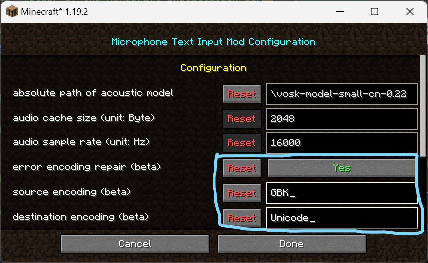

# **Fabric Microphone Text Input Mod Developer Documentation**
### 　　　　　　　　　1.1.0


## Introduction

### Functionality
This mod allows you to use your microphone to input text and send it as a player message. It is a client-side mod, so it does not require any server-side setup.

### Operating Principles
This mod uses [VOSK Offline Speech Recognition API](https://alphacephei.com/vosk/) to recognize the text from the microphone. The recognized text will be sent to the server as a player message when the user presses the `V` key.

### What's New in 1.1.x
- Use [VOSK Offline Speech Recognition API](https://alphacephei.com/vosk/) to recognize text from the microphone instead of [CMU Sphnix](https://cmusphinx.github.io/), so that the recognition is more accurate and the recognition speed is faster.
- Add a configuration UI by importing [MidnightLib](https://github.com/TeamMidnightDust/MidnightLib) so that you can configure the mod to choose the language model, and since 1.1.0 we will not provide the language model in the mod package, you need to download the language model from [VOSK Models](https://alphacephei.com/vosk/models).

## Developer Guide
### Setup
1. Install Java Development Kit 17;
2. Install IntelliJ IDEA;
3. Clone the project from my GitHub Repository;
4. Open the project in IntelliJ IDEA and wait for it to finish loading.

### Configuration List
| Dependency            | Type                               | Recommended Configuration      | Description                                                           |
| --------------------- | ---------------------------------- | ------------------------------ | --------------------------------------------------------------------- |
| JDK17                 | Development Kit                    | Java SE Development Kit 17.0.6 | The Java development environment toolkit on which the project depends |
| IntelliJ IDEA         | Integrated Development Environment | Latest Version                 | The IDE used to develop the project                                   |
| git                   | Version Control System             | Latest Version                 | The version control system used to manage the project                 |
| Minecraft Development | IntelliJ IDEA Plugin               | Latest Version                 | The plugin used to develop Minecraft mods                             |

### FAQ
#### Q: Why the program cannot to recognize the text from the microphone?
##### A: The program cannot recognize the text from the microphone may be caused by the following reasons:
- The microphone cannot be used due to incorrect microphone settings on the computer;
> For example, if your operating system is Windows 11, you need to check you settings in the `Control Panel` -> `Microsoft.Sound` -> `Recording`, and make sure that the microphone can be used normally.
> 
> And then you need to check in the `Settings` -> `System` -> `Sound` -> `Input`, and make sure that the sound input device is correct.
> 
- Java cannot access the microphone due to incorrect Java permission settings;
> For example, if your operating system is Windows 11, you need to check you settings in the `Settings` > `Privacy & security` > `Microphone`,and make sure `Microphone access` is turned on.
> 
> Then you need to check in the `Settings` > `Privacy & security` > `Microphone`, and make sure that `Let desktop apps access your microphone` is turned on.
> 
> For more information, please refer to [Fix microphone problems](https://support.microsoft.com/en-us/windows/fix-microphone-problems-5f230348-106d-bfa4-1db5-336f35576011#WindowsVersion=Windows_11)
- The language model is not selected correctly;
> if you are a developer, you can check the `mcmti.json` file in the `run/config` folder in your project, and make sure that the `acousticModelPath` is the absolute path of the language model. Here is an example:
> ```json
> {
> "acousticModelPath": "E:\\Coding\\Java\\MDK\\Fabric-Microphone-Text-Input\\models\\vosk-model-small-cn-0.22",
> "cacheSize": 3072,
> "sampleRate": 16000,
> "encoding_repair": false,
> "srcEncoding": "UTF-8",
> "dstEncoding": "UTF-8"
> }
> ```
> If you want to change the language model, you can download the language model from [VOSK Models](https://alphacephei.com/vosk/models), and then change the `acousticModelPath` to the absolute path of the language model.
#### Q: Why speech recognition can recognize normally, but the output is messy code?
##### A: The output is messy code may refer to the default encoding for your project, IDE, or system.
> - Check the encoding of the project.
> > In `build.gradle` you can check `tasks.withType(JavaCompile).configureEach` and add `it.options.encoding = 'UTF-8'`. There is an example:
> > ```groovy
> > tasks.withType(JavaCompile).configureEach {
> >    it.options.encoding = 'UTF-8'
> > }
> > ```
> - Check the encoding of the IDE.
> > In IntelliJ IDEA you can check the encoding of the project in the `File` -> `Settings` -> `Editor` -> `File Encodings`, and make sure that the `Project Encoding` is `UTF-8`.
> > 
> > And then you can check the encoding of the IDE in the `Help` -> `Edit Custom VM Options`, and make sure that `-Dfile.encoding=UTF-8` is added to the end of the file.
> - Check the encoding of the system.
> > For example, if your operating system is Windows 11, you can check the encoding of the system in `Control Panel` -> `Clock, Language, and Region` -> `Region` -> `Administrative` -> `Change system locale`, and use `Beta: Use Unicode UTF-8 for worldwide language support` instead of `Beta: Use Unicode UTF-8 for worldwide language support` like this:
> > 
#### Q: Why the mod in the develop environment can work normally, but the mod Jar cause a crash in the game?
##### A: This is most likely due to developers referencing third-party libraries that are not mods, and they were not compiled together when compiling Jar files. To solve this problem, you can add the following code to the `build.gradle` file:
> ```groovy
> jar {
>    from {
>       configurations.compileClasspath.findAll() {
>           it.name.endsWith(".jar") && it.name.contains("name of yor third-party library")
>       }.collect {
>           zipTree(it)
>       }
> }


## User Guide

### 1. Installation
> 1. Download the appropriate version of Minecraft with Fabric loader;
> 2. Install the appropriate version of the [Fabric API](https://modrinth.com/mod/fabric-api) and [MidnightLib](https://modrinth.com/mod/midnightlib) and [Mod Menu](https://modrinth.com/mod/modmenu) as dependencies;
> 3. Download the 1.1.0 version of the mod from [GitHub Releases](https://github.com/Jaffe2718/Fabric-Microphone-Text-Input/releases) or [Modrinth](https://modrinth.com/mod/microphone-text-input);
> 4. Put the downloaded mod JAR file into the `mods` folder of the Minecraft installation directory;
### 2. Configuration
> notice: Since 1.1.0, we will not provide the language model in the mod package, you need to download the language model from [VOSK Models](https://alphacephei.com/vosk/models).This mod will not work properly without the correct configuration.
> 1. Download the language model from [VOSK Models](https://alphacephei.com/vosk/models) and extract it. The recommended path is `...\.minecraft\versions\YOUR_GAME_VERSION\.mcmti\models`, if the folders do not exist, you need to create them.
> 2. Launch Minecraft and enter the game;
> 3. Click the `Mods` button in the main menu;
> 4. Click the settings button of the `Fabric Microphone Text Input` mod,
> 
> Then you will enter the configuration UI of `Fabric Microphone Text Input Mod`;
> 5. Fill the absolute path of the language model like this:
> > 
> and ensure to click the `Done` button to save the configuration.
> 6. Restart Minecraft and enter the game.
> 7. Enter the game and press `V` to recognize the text and automatically send as a chat message.
> 8. If the message is messy code, please try the error coding repair function, this is an example:
> > 
> > Warning: This function is an experimental function, and it may cause the recognition to fail.

## About
### Repository
[GitHub](https://github.com/Jaffe2718/Fabric-Microphone-Text-Input)
### License
This mod is licensed under the [MIT License](LICENSE)
### Author
[Jaffe2718](https://github.com/Jaffe2718)
### Issue
If you have any questions or suggestions, please submit an issue on [GitHub Issues](https://github.com/Jaffe2718/Fabric-Microphone-Text-Input/issues).
### Contact
You can also contact me through the following methods:
[Bilibili Jaffe-](https://space.bilibili.com/1671742926)